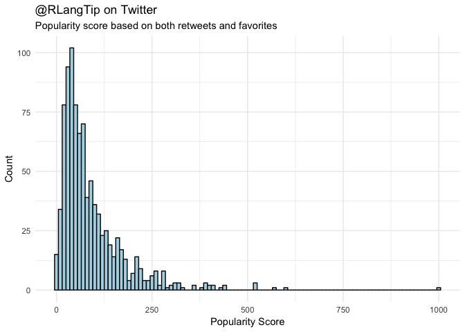
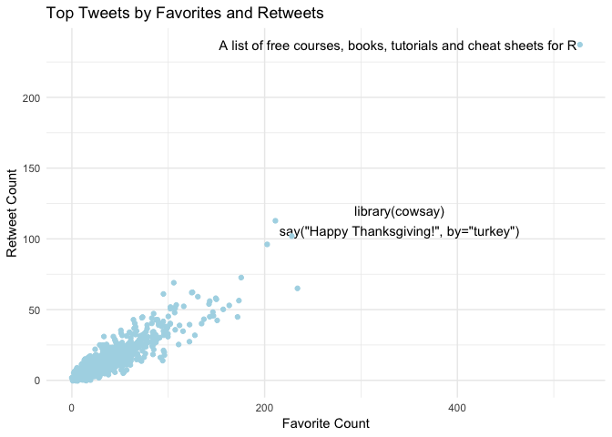

<!-- README.md is generated from README.Rmd. Please edit that file -->

# rlangtip 

An R package to print out a useful tip in R. Based on the history of the
\[@RLangTip\](<http://twitter.com/RLangTip>) Twitter
account.

## Installation

This package isn’t yet on CRAN. To install, use

    devtools::install_github("revodavid/rlangtip")

## Usage

After loading the package, use:

    rtip()

to generate a random tip. See `help(rtip)` for more options.

Would you like to contribute a tip to this package? See
[Contributions.md](Contributions.md) for details or run the `submit_tip`
function 😄.
